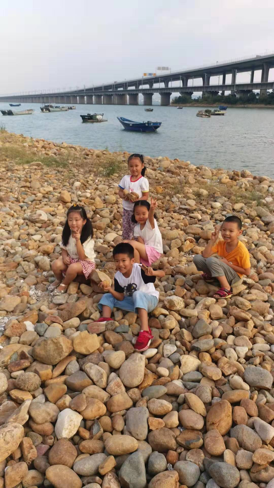

<!---
markmeta_author: wongoo
markmeta_date: 2019-09-22
markmeta_title: 我们一起来看桥
markmeta_categories: 记录
markmeta_tags: 书图,幼儿园
-->

# 我们一起来看桥

幼儿园老师说要让小朋友们看桥、认识桥，约了书图同班的一些同学一起去园博园看杏林大桥。
另外，还捡了一些自己觉得漂亮的石头去学校（但忘记捡树枝了）。
给他讲的一些知识不知有没有记住？
- 汽车桥为什么像波浪上下起伏？
- 火车桥为什么是直的？
- 桥墩的特点？
- 鹅卵石为什么是光滑的？

和小朋友们一起玩很开心，但有时候跟随自己的想法，没和小朋友们玩在一起。

有时候会主动去帮助同学，但开始跑步比赛的时候就一溜烟跑老远。

现在分享做得很好，很愿意和小朋友们分享食物。

唯一做得比较过分的一件事是往同学淑娴妈妈脖子撒沙子，我马上制止并呵斥他。
书图，己所不欲勿施于人，希望你早日明白！

