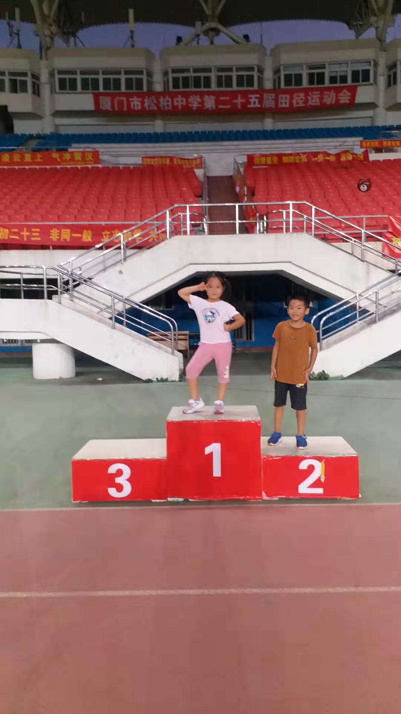

<!---
markmeta_author: wongoo
markmeta_date: 2019-09-28
markmeta_title: 和妹妹一起玩
markmeta_categories: 记录
markmeta_tags: 书图,妹妹,感触,成长
-->

# 和妹妹一起玩

刚好有空，把书图干爹赢得的薄饼状元礼物送过去，书图刚好有空和妹妹一起玩。

去体育场踢足球，踢的很开心。

发现书图开始懂得模仿别人表现以争取表扬。 
妹妹能主动说谢谢，我表扬了她。图图也马上说谢谢爸爸，我也表扬了他。

干妈炒的菜和炖的汤都很美味，符合图图的胃口，踏踏实实的吃了一大碗饭。

## 感触

1. 去体育场玩，遇到其他家长带小孩来玩，大家都很注意教育小孩要如何和其他小孩玩，遵守一些基本的规则，就算发生矛盾，大家都很清楚处理方式，不会盲目职责其他小孩。 或许这就是素质！ 多和高素质的人在一起，也会提高自身素质；

2. 妹妹已经认识了很多字，能够按着书上念一些简单的句子； 之前有交图图识字，后来落下了，得赶紧补上，立刻给他买了识字得书；

3. 玩起来书图还是有时候做一些冷静下来知道是错误的事，比如摸别人屁股，我抓住他，语气严肃的告诉他多次，这是非常严重的错误，希望他不要再犯。

4. 不能凶他太多，我一凶起来他就跑，马路边上跑就特别危险； 再凶也得注意场合，私底下慢慢教育他；

