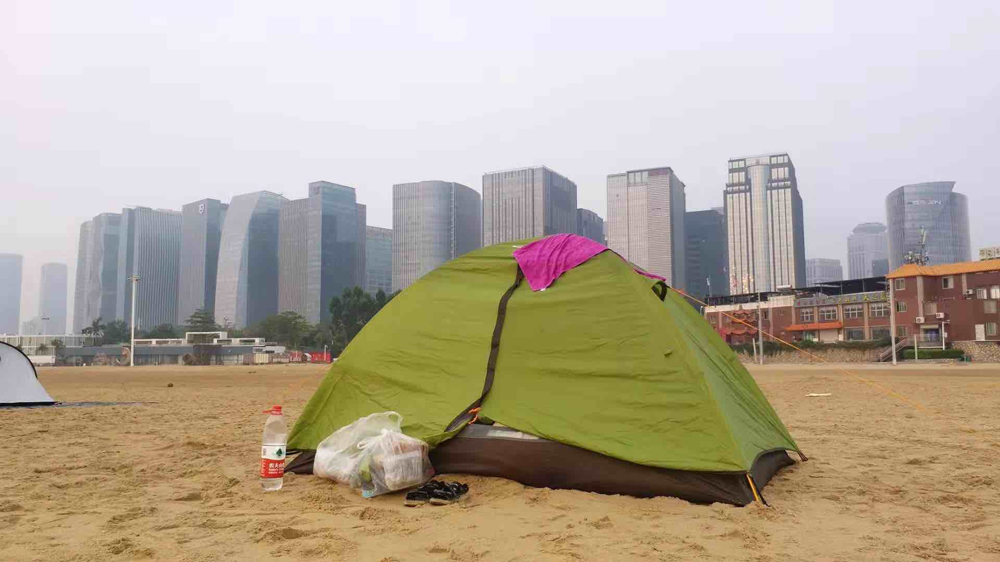
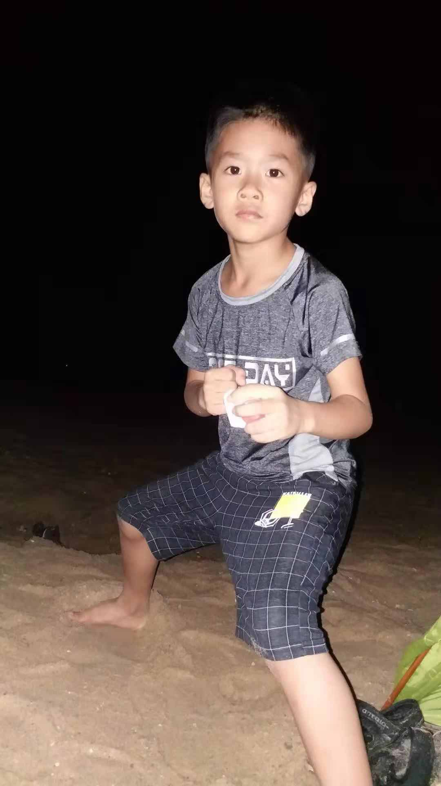
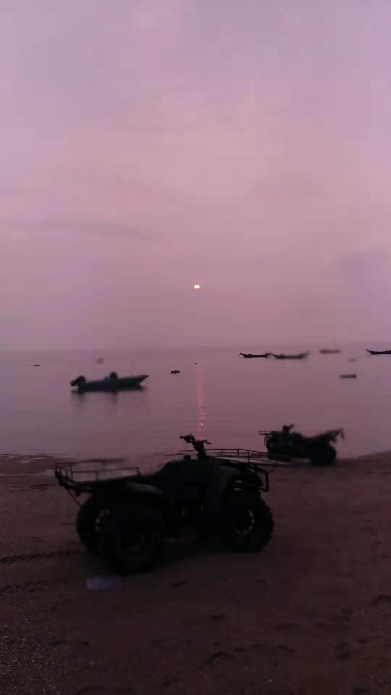

<!---
markmeta_author: wongoo
markmeta_date: 2019-10-04
markmeta_title: 露营
markmeta_categories: 记录
markmeta_tags: 书图,露营
-->

# 露营

之前就许诺带书图去露营，国庆有时间，刚好借到一辆车，就决定带书图去露营。

本来要去山上，时间太晚了，就去观音山沙滩露营。

有沙子玩，有水玩，书图特别开心。

搭完帐篷，吃完晚餐，我们在沙滩上玩起来，奥特曼对打，斗牛，沙地写字，夜空下的心灵对话。

本来不想洗澡直接睡了，但观音山沙滩有一个音乐酒吧，吵到一两点才结束。

带着图图12点去酒吧旁边的一个小澡堂子洗澡，那时候都没热水了，冷冷的冲了一下，虽然没有干净的衣服换，但也舒服很多。

书图一点多睡着了，我却很难睡着！

沙地凹凸不平，也很硬，躺在上面很难有舒服的感觉。

到了半夜，偶尔还会有人在海边散步，从帐篷外走过，一路讲着话。

早上很早，每家渔民都骑着沙滩摩托，带着打鱼装鱼的装备来到海边，哒哒哒，哒哒哒 ... , 从帐篷边上经过

天蒙蒙亮，打开帐篷看到海边已经很多人了，都弯着腰，好像在捡花蛤. 

还有很多扛着相机的人在等着拍日出。

云雾比较浓，一开始看不见太阳，等太阳出现的时候已是在海面之上，没能看到从地平线升起的景象	，但大家都热情的拿起相机疯狂的拍摄，
我也从帐篷钻出来，到海边拍摄起来！

书图昨晚睡得晚，今天睡到8点多，太阳都升得老高了才愿意爬起来。

起来第一个事情就是去玩沙子！

我收拾完帐篷，天气已经变得很热了！

催促书图不要玩了，太热了！

我们回到车上，准备开车回家！ 半路上想着还可以去看一个电影，于是开车去看《攀登者》！

电影讲珠穆兰玛峰的故事，想着书图会很喜欢，但他觉得很恐怖，他有些不太喜欢这种危险有人牺牲的电影，不过最终还是看完了。

看完电影回到家，刚好吃午饭！

充实有意义的一次露营！

