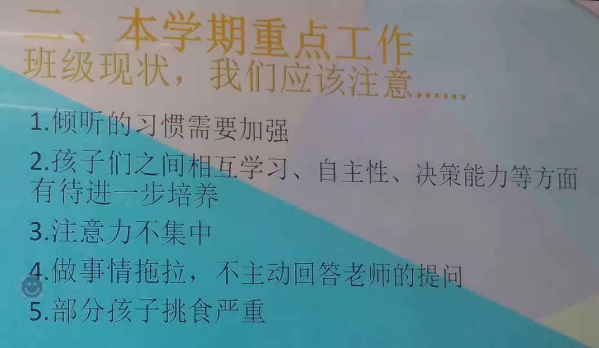
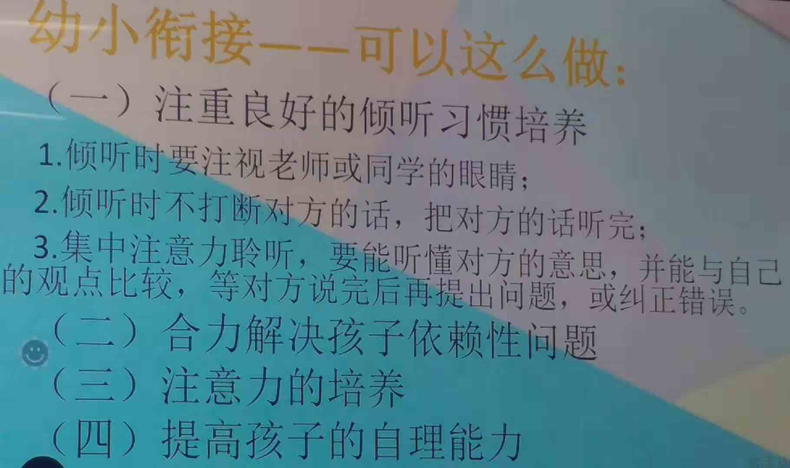
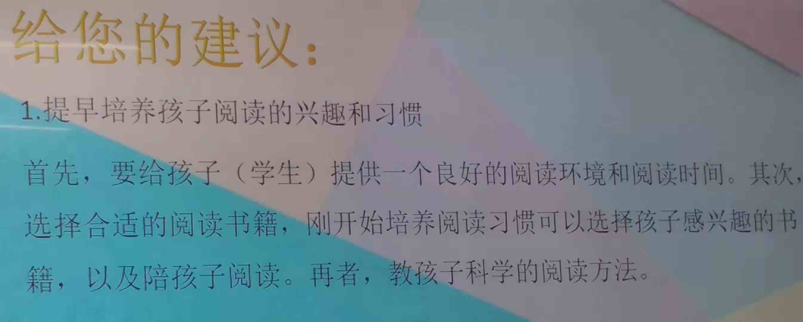
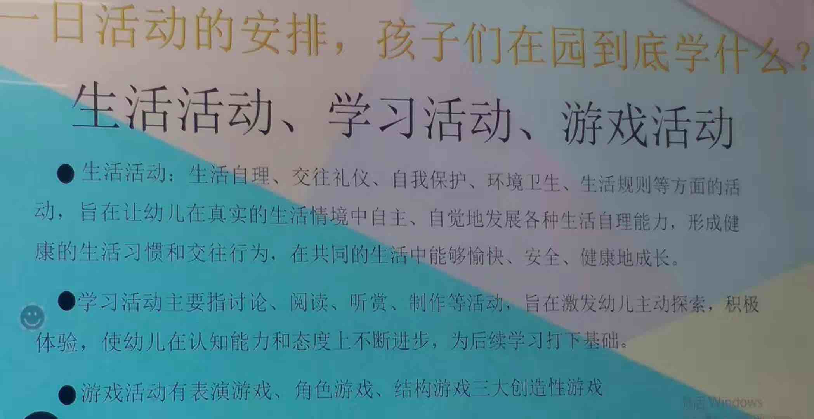
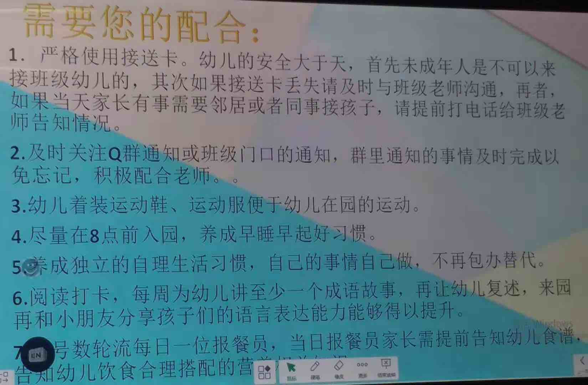

<!---
markmeta_author: wongoo
markmeta_date: 2019-10-12
markmeta_title: 家长会感悟
markmeta_categories: 经验
markmeta_tags: 书图,成长
-->

# 家长会感悟

昨天晚上书图幼儿园班上要开家长会，我去参加了。
李老师提出了班上很多同学都存在的问题，各位家长也积极的分享，彭老师李老师解答了大家的疑问，感触收获很多。
另外，还有默默付出的陈老师，细心周密的照顾着小朋友们。
非常感谢老师们的辛劳付出，两年多来小朋友们都发生了很大的变化。
进入幼儿园大班，意味着即将进入小学，需要家长们更多关心和投入。

## 1. 老师分享

首先老师提出了大多小朋友存在的问题， 这些问题我发现书图都存在。

1. **<u>倾听习惯要加强</u>**： 现实生活中我们大人可能更看重效率倾听书图的少了，所以反过来他也比较少倾听他人的，这点大人要更有耐心；
2. **<u>相互学习、自助性、决策能力等有待培养</u>**：书图和其他小朋友交往太少，需多增加他和其他小朋友交往的机会，发现和学习其他小朋友优秀的地方；另外要多让他参与家务，自己的事情自己做；不要因为做得慢就去插一把手，可以在旁边指导督促一下；当然做这些事情一定要让他明白其中的道理和必要性，让他自己愿意去做。
3. **<u>注意力不集中</u>**：书图很容易转移注意力，思维是发散型的；这点要慢慢培养，平时他专注做一个事情的时候尽量少去打扰；这需要爸爸妈妈爷爷奶奶都能去做到。另外晚上要多陪他看书，这也可以培养专注力；
4. **<u>做事拖拉，不主动回答老师提问</u>**：拖拉是行为习惯的问题，我觉得要培养目标感，还是随时把沙漏拿出来定好时间，做到了多表扬，多奖励笑脸； 不主动回答这是礼貌问题，平时我们大人也要多尊重小孩，认真倾听认真回答，小孩有礼貌问题了，要及时意识到，并及时严肃纠正。
5. **<u>挑食</u>**：挑食这个问题，我觉得是有历史原因的，以前做饭可能不会太上心，按照大人口味来做。有专为小孩做得菜，往往也没有太用心。菜不好吃，他自然不愿吃，以后就遇到一个新的菜都会带有怀疑的态度，第一口下去有点硬不吃，有点辛不吃，颜色不好看不吃。每次图图去干妈家，胃口就很好，说菜很好吃。所以做菜这方面可以多请教一些其他爸爸妈妈，另外还是要多鼓励他多尝试。 李老师说，昨天书图开始吃虾仁了，这是他之前看到就要吐的，看来我前一天鼓励他还是有效果。

这学期很重要一个内容就是幼小衔接！也是书图现在最需要进步的：

1. **<u>倾听习惯</u>**：生活中纠正和培养，做一些倾听游戏
2. **<u>专注力</u>**：通过每日阅读培养专注力；收集一些专注力游戏和活动；
3. **<u>自理能力</u>**：自己拿衣服、自己洗澡、自己洗衣服、自己刷牙、自己准备书包、自己收拾书本玩具

关于阅读认字，弄清楚了一个疑问，之前一直认为是幼儿园不建议教孩子认字。
彭老师解释说：**幼儿园强调的是快乐学习，认字通过阅读绘本的过程中潜移默化的让孩子认识汉字，并不会特别拿出某一个汉字来教**。 认字主要还是要考家长来进行教学，有的推荐识字app，有的推荐字卡，当然还有专业的幼儿识字的书籍。

另外，还知道被公认为班上最聪明的禹睿同学，还会下象棋和五子棋，经常被老师夸聪明，书图也天天回来讲。看来我也要买象棋、围棋了😁。

幼儿园教学主要有 生活活动、学习活动、游戏活动。 主要教学内容也是现在小孩最需要学习成长的。

为了锻炼小朋友的表达能力，老师弄了一个成语打卡，非常认同。
这个得整理出来贴在墙上避免忘记。

另外，报餐员这个活动，可能很好的解决挑食的问题，需要家长们大力支持。

## 2. 家委发言

家委泽楷妈妈提出要为小朋友搞一次有意义的活动，准备了详细的活动方案，很是用心，希望能给小朋友们留下一个美好的回忆。

## 3. 自由讨论

自由讨论环节，各位家长踊跃发言。提出了一些问题和观点。 

1. **<u>幼儿园要学认字了</u>**: 为了让小朋友到小学更好的适应小学生活，不至于落后，自信心受打击。
2. **<u>幼儿园多学一年级二年级很轻松，变得骄傲，三四年级走下坡路</u>**:  大家认为要避免骄傲，需要培养小孩志向，需要让小孩知道目标方向，还要让他有更大的视野。
3. **<u>有空都参与一些教育类培训</u>**：可以学到很多理念和技巧
4. **<u>小朋友要多交流相互学习</u>**：比如泽楷会自己睡了是因为其他同学也自己睡，书图开始自己洗澡是知道其他同学已经开始自己洗澡；家长们说可以多交流让小朋友们都去学习文字；

## 4. 教育理念

教育小孩是一门学问，每次交流都会有新的感悟， 方法技巧太多，重点在于要有正确的教育理念。
这次家长会我总结了一些教育理念，不时反思提醒自己！
- 教育是一个持续性的过程，需要持之以恒！
- 教育小孩实际是一个教育大人的过程！
- 小孩给了大人一个学习审视自己的机会！
- 信任和鼓励能让小孩成为最好的自己！
- 小孩最终要走自己的路，尽早让他们学会走，然后放手！
- 梦想是方向，是动力源泉，为他们塑造一个梦想！

