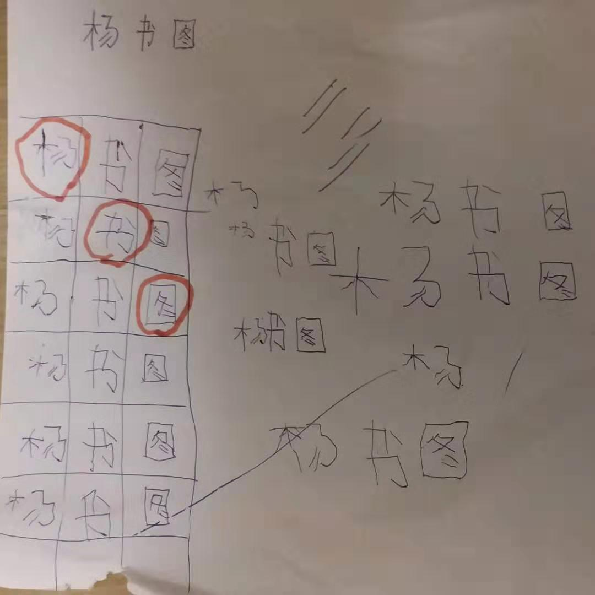

<!---
markmeta_author: wongoo
markmeta_date: 2019-10-22
markmeta_title: 不遵守规则的惩罚
markmeta_categories: 记录
markmeta_tags: 书图,成长
-->

# 不遵守规则的惩罚

昨天彭老师给我发信息，看能中午否接书图回去。
看上去老师压力很大，我打电话过去询问情况，大致的问题是：
- 大家玩游戏的时候捣乱；
- 老师把他叫到身边，也不属管教；
- 老师警告要拍照给爸爸，还故意跳一段舞蹈；

我分析他的问题：

1. `规则意识不强，耐心不足`: 我感觉玩游戏在他心中是有规则的，但规则意识不强，没有想着一定要遵守游戏规则流程；
	当游戏进行中时，他会融入到游戏气氛中去，但暂时无法参与，又耐心不足，就下意识的绊一腿，拉一手，从中使乱。

2. `专注力不足, 规则理解不够`: 可能老师再讲规则的时候，他注意力在其他地方； 老师讲完规则开始玩游戏，他这才把注意力放到游戏上。
	老师要拍照，这次是有警告的意思，但可能他完全没有体会到。

3. `不尊重老师长辈`: 骨子里面他是怕老师的，我多次问他说要大胆的去问老师，但因为常犯错被责罚多了，他说怕。
	所以有问题可能他一般不会问老师。
	被叫到老师身边并没有约束一下自己，我感觉可能在家里平等对待各自的意见比较多了；
	而且没有及时意识到他逐渐喜欢用狡辩应对督促和责罚，慢慢丢失了对长辈的尊重。

针对他的问题，我想了一些应对方法：
1. `当裁判: 规则复述和规则执行`: 提前告知他要复述游戏规则，老师讲完让他复述； 做游戏的时候，一开始让他做规则维护者，有不遵守规则的让他及时制止。 
2. `责罚和警告要明确`: 具体的责罚措施要明确告知，让他提前注意自己的行为；犯错责罚要严格执行；
3. `学会等待`: 有意识的安排他等待，并告知他好好等待，轮到他了就会有小小奖励。  

接到老师通知后，中午书图妈妈去接他离开学校，让他在学校门口罚站三小时。

晚上回来让他认真的做好每一个事，刷牙，洗澡，练字，看书。
不能在看电视，听节目，也不能出去玩。
告诉他爸爸妈妈都会听老师话，他在学校必须听老师话，做游戏要听从老师安排，认真坐好，中午饭要认真吃完，不然回来没饭吃。
我告诉他我会每天问老师，你在学校表现咋样，表现不好回来罚站。

当然最后告诉他： `爸爸妈妈是爱你的，希望你变得越来越好!`

