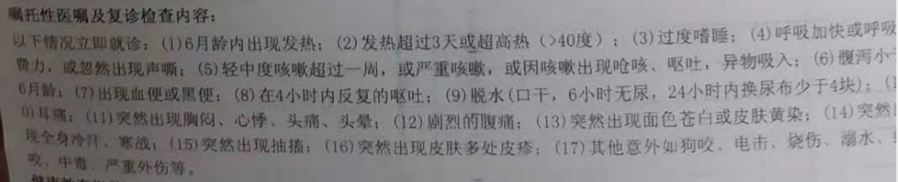

<!---
markmeta_author: wongoo
markmeta_date: 2019-10-01
markmeta_title: 寻意拉肚子
markmeta_categories: 伤病
markmeta_tags: 寻意,腹泻
-->

# 寻意拉肚子

今天国庆，祖国70周岁生日，有精彩的大阅兵，但寻意拉肚子了。

寻意昨天下午开始拉肚子，有给他吃妈咪爱，但今天早上拉了2次，下午又拉了，并未好转，于是第一医院急症检查一下。

医生简单询问了病情，开了点药，但要化验粪便，要等他再拉拿去化验，但不清楚要等到什么时候。

刚好小姨子开车来接我们和寻意外婆他们一起吃饭，就先回去了。

寻意还小，我和妈轮流在家照顾他，等我去吃完饭回来，寻意拉了，于是收集到小瓶子里再去医院去化验。

医院急症人很多，排队排了很久，等化验报告又等了40分钟。

医生看了化验报告说：
- 有些炎症
- 目前先用止泻的奶粉先吃，观察3天，如果正常了，再花三天时间慢慢换回正常奶粉； 如果还拉，就挂特定医生确定更换其他奶粉。

## 已开药

| 药名 | 用药 | 剂量 | 天数 | 用药方法 | 频次 |
| ---- | ---- | ---- | ---- | -------- | ---- |
| 4+7蒙脱石散(基)（新必奇）    |   1   |   g   |   3   |   空腹服用 | t.i.d |
|布拉氏酵母菌散 | 1 | 袋 | 3 | 口服 | q.d |

## 医嘱

整理的时候发现其中第4点， 呼吸费力突然声撕， 好像有声撕，但呼吸还好，只是有时候鼻子好像有点堵， 需要重点继续观察。

## 粪便检查报告

- 黄色，糊状； 
- 未检出： 粘液、白细胞、红细胞、霉菌、寄生虫卵、脂肪球 ；
- 隐血（单克隆）：阴性
- 钙卫蛋白： 弱阳性 （医生说此项可能是有炎症，也没说要特别注意什么）

## 参考

Diarrhea, 美  [,daɪə'riə], n. 腹泻，痢疾

